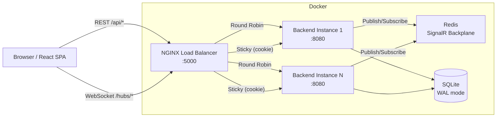

# Financial Monitor

A full-stack application for real-time financial transaction monitoring. Built with ASP.NET Core 8, React 19, SignalR, and Redis.

Transactions are created, updated, and displayed in real time across **all connected clients**. The architecture supports horizontal scaling via a Redis-backed SignalR backplane and an NGINX load balancer with sticky-session routing for WebSocket connections.

The frontend features a modern UI with **smooth status-transition animations**, a **live snackbar notification system** for new transactions arriving in real time, a **dashboard card view** alongside the traditional table, and **filter controls** to narrow transactions by status.

---

## Table of Contents

- [Running with Docker (recommended)](#running-with-docker-recommended)
- [Running Locally (without Docker)](#running-locally-without-docker)
- [Architecture](#architecture)
- [Technology Stack](#technology-stack)
- [Repository Structure](#repository-structure)
- [Backend API](#backend-api)
- [SignalR / Real-Time Events](#signalr--real-time-events)
- [Configuration](#configuration)
- [Testing](#testing)
- [Development Notes](#development-notes)
- [Important Deployment Considerations](#important-deployment-considerations)

---

## Running with Docker (recommended)

Docker Compose runs the entire stack — frontend, backend (with load balancer), Redis, and SQLite — without installing any SDK locally.

### Prerequisites

- [Docker](https://docs.docker.com/engine/install/) with Compose V2 (included in Docker Desktop / Docker Engine 24+)

### Quick Start

```bash
# Build and start all services
docker compose up --build

# Open in browser:
#   http://127.0.0.1:5174
```

That's it. The load balancer starts on port 5000, the frontend on port 5174. The backend is accessible through the load balancer at `http://127.0.0.1:5000`.

### Scaling Backend Instances

Use `--scale backend=N` to run multiple backend replicas behind the load balancer:

```bash
# Start with 3 backend instances
docker compose up --build -d --scale backend=3

# Or 5 instances
docker compose up --build -d --scale backend=5
```

Each replica connects to the shared SQLite database and the Redis backplane. The load balancer automatically discovers new replicas (Docker DNS, checked every 10s). Open the frontend at `http://127.0.0.1:5174` — transactions created on one instance broadcast to all connected clients in real time.

### Useful Commands

| Command | Description |
|---------|-------------|
| `docker compose up --build` | Build and start all services (foreground) |
| `docker compose up --build -d` | Start in detached (background) mode |
| `docker compose up --build -d --scale backend=3` | Start with 3 backend instances |
| `docker compose logs backend-lb` | View load balancer logs |
| `docker compose logs backend` | View backend logs |
| `docker compose down` | Stop and remove containers |
| `docker compose down -v` | Stop and delete the shared SQLite volume (resets data) |

### Services Reference

| Service | Build Source | Internal Port | Host Port | Description |
|---------|-------------|---------------|-----------|-------------|
| `redis` | `redis:7-alpine` | 6379 | 127.0.0.1:6379 | SignalR backplane (real-time message relay) |
| `backend` | `server/Dockerfile` | 8080 | — | ASP.NET Core API (can scale to N replicas) |
| `backend-lb` | `loadbalancer/Dockerfile` | 5000 | 127.0.0.1:5000 | NGINX load balancer (entry point for all backend traffic) |
| `frontend` | `client/Dockerfile` | 80 | 127.0.0.1:5174 | React SPA (served by nginx) |

### Docker URLs

| URL | What you get |
|-----|-------------|
| `http://127.0.0.1:5174` | Frontend SPA |
| `http://127.0.0.1:5000/api/transactions` | REST API (via load balancer) |
| `http://127.0.0.1:5000/health` | Health check (returns `{ status, instance }`) |
| `http://127.0.0.1:5000/lb-debug` | Sticky-session diagnostics |
| `http://127.0.0.1:5000/sticky-test` | Sticky-session verification |

### How Docker Works

1. The load balancer resolves backend replica IPs via Docker DNS at startup and generates an NGINX config.
2. A background watcher re-resolves every 10 seconds and reloads NGINX (`SIGHUP`) when IPs change (e.g., after `--scale backend=5`).
3. Backend replicas share a Docker named volume (`sqldata`) for the SQLite database.
4. The frontend container generates `config.js` at runtime with the backend URL.

---

## Running Locally (without Docker)

For development when you want hot-reload, debugger attach, or no Docker overhead.

### Prerequisites

- Node.js 20.x
- .NET SDK 8.0
- Redis 7.x (optional — needed only for multi-instance testing)

### Steps

```bash
# 1. Install frontend dependencies
cd client && npm ci && cd ..

# 2. Start Redis (skip if you're running a single instance)
redis-server

# 3. Start the backend (listens on http://localhost:5120)
dotnet run --project server/FinancialMonitor.Api/FinancialMonitor.Api/FinancialMonitor.Api.csproj

# 4. Start the frontend dev server (opens on http://localhost:5173)
cd client && npm run dev
```

The Vite dev server proxies `/api` and `/hubs` to the backend automatically — no environment variables needed.

---

## Architecture



### Data Flow

| Step | Description |
|------|-------------|
| **REST API** | The browser sends HTTP requests (`POST /api/transactions`, `PUT /api/transactions/{id}/status`) through the load balancer (round-robin) to a backend instance. |
| **SignalR** | The browser opens a WebSocket connection to `/hubs/transactions` through the load balancer. Sticky sessions (`hash $cookie_signalr_id consistent`) ensure all WebSocket frames from one client reach the same backend instance. |
| **Persistence** | The backend writes to a shared SQLite database (WAL mode, 5-second busy timeout) via EF Core. |
| **Real-time broadcast** | After any create/update, the backend broadcasts `TransactionCreated` or `TransactionStatusUpdated` via SignalR. With Redis configured, the SignalR message fans out through the Redis backplane to **all** backend instances, which forward it to their connected clients. |

### Redis Backplane

Redis is **required** for multi-instance setups. Without it, each backend instance broadcasts only to its own directly connected clients. Single-instance local development works without Redis by leaving `Redis:ConnectionString` empty.

### Frontend UI Features

| Feature | Description |
|---------|-------------|
| **Status transition animations** | When a transaction status updates to Completed or Failed, the badge pulses with a color-matched animation (green/gold) to draw attention. |
| **Live snackbar notifications** | New transactions arriving via SignalR appear as toast notifications in a stacked snackbar. Each notification auto-dismisses after a few seconds or when the transaction appears in the main list. |
| **Table / Dashboard toggle** | Switch between a tabular view (with inline status picker for Pending transactions) and a card-based dashboard view with large amounts and status badges. |
| **Status filter** | Filter the displayed transactions by status (All / Pending / Completed / Failed). |
| **Summary cards** | Four summary cards at the top show total, pending, completed, and failed counts at a glance. |

### Load Balancer Sticky Sessions

The NGINX load balancer uses two upstream pools:

| Pool | Routing | Use |
|------|---------|-----|
| `backend_api` | Round robin | REST API calls (`/api/`, `/health`) |
| `backend_signalr` | `hash $cookie_signalr_id consistent` | SignalR WebSocket and negotiate (`/hubs/`, `/sticky-test`, `/lb-debug`) |

The frontend generates a `signalr_id` cookie (8 random hex bytes via `crypto.getRandomValues`) before establishing the SignalR connection, ensuring the negotiate request and subsequent WebSocket upgrade land on the same backend instance.

---

## Technology Stack

| Layer | Technology | Version |
|-------|-----------|---------|
| Frontend framework | React | 19.x |
| Language | TypeScript | ~6.0 |
| Build / dev server | Vite | 8.x |
| Real-time client | @microsoft/signalr | 10.x |
| Backend framework | ASP.NET Core | 8.0 |
| ORM | Entity Framework Core | 8.0 |
| Database | SQLite | (EF Core provider) |
| Real-time server | SignalR (StackExchangeRedis) | 8.0 |
| Backplane | Redis | 7-alpine |
| Load balancer | NGINX | alpine |
| Containerization | Docker / Docker Compose | — |
| Orchestration | Kubernetes manifests | — |

### Testing

| Scope | Framework | Location |
|-------|-----------|----------|
| Backend unit tests | xUnit + Moq | `tests/FinancialMonitor.Api.Tests/` |
| Backend integration tests | xUnit + WebApplicationFactory | `tests/FinancialMonitor.Api.IntegrationTests/` |
| Client unit tests | Vitest + testing-library | `tests/FinancialMonitor.Client.Tests/` |
| E2E tests | Playwright | `tests/FinancialMonitor.E2E/` |

---

## Repository Structure

```
real-time-financial-monitor/
├── client/                          # React SPA (Vite + TypeScript)
│   ├── src/
│   │   ├── api/                     # HTTP client + SignalR hub connection
│   │   ├── components/              # Reusable UI components
│   │   ├── data/                    # Summary calculations
│   │   ├── hooks/                   # useTransactions (SignalR + API)
│   │   ├── pages/                   # Entry, AddTransaction, Monitor, Dashboard
│   │   └── types/                   # Transaction types and guards
│   ├── nginx/default.conf           # SPA serving config
│   ├── docker-entrypoint.sh         # Runtime config injection
│   └── Dockerfile                   # Multi-stage: Node build → nginx serve
├── server/
│   └── FinancialMonitor.Api/FinancialMonitor.Api/
│       ├── Controllers/             # TransactionsController (REST)
│       ├── DTOs/                    # Request/response types
│       ├── Data/AppDbContext.cs      # EF Core context
│       ├── Hubs/TransactionHub.cs    # SignalR hub (marker)
│       ├── Migrations/              # EF Core migration (InitialCreate)
│       ├── Models/                  # Transaction entity + enums
│       ├── Repositories/            # TransactionRepository + interface
│       ├── Services/                # TransactionService (business logic)
│       ├── Program.cs               # Startup, DI, endpoint mapping
│       ├── appsettings.json         # Prod config (empty Redis)
│       └── appsettings.Development.json  # Dev config (127.0.0.1:6379)
├── loadbalancer/
│   ├── entrypoint.sh                # Dynamic upstream discovery + nginx config gen
│   └── Dockerfile                   # nginx:alpine
├── k8s/
│   ├── deployment.yaml              # 3 replicas, emptyDir SQLite
│   └── service.yaml                 # ClusterIP
├── tests/                           # All test projects
├── docker-compose.yml               # redis + backend + backend-lb + frontend
└── DISTRIBUTED_ARCHITECTURE.md      # Extended architecture documentation
```

---

## Backend API

Base URL (local): `http://localhost:5120`  
Base URL (Docker, via load balancer): `http://127.0.0.1:5000`

### Endpoints

| Method | Route | Request Body | Response | Errors |
|--------|-------|-------------|----------|--------|
| `GET` | `/api/transactions` | — | `200` — array of transactions | — |
| `POST` | `/api/transactions` | `{ amount, currency, status }` | `201` — created transaction | `400` — validation failure |
| `PUT` | `/api/transactions/{id}/status` | `{ status }` | `204` — no content | `400` — invalid input, `404` — not found, `409` — not Pending |
| `GET` | `/health` | — | `200` — `{ status, instance }` | — |
| `GET` | `/lb-debug` | — | `200` — sticky-session diagnostics | — |
| `GET` | `/sticky-test` | — | `200` — `{ status, instance }` | — |

### Transaction Statuses

```
Pending ──────► Completed   (terminal)
Pending ──────► Failed      (terminal)
```

Only `Pending` transactions accept status updates. Valid `status` values for `POST` are `Pending`, `Completed`, `Failed`. Valid values for `PUT` are `Completed`, `Failed`.

### Example: Create a Transaction

```bash
curl -X POST http://localhost:5120/api/transactions \
  -H "Content-Type: application/json" \
  -d '{"amount":1500,"currency":"USD","status":"Pending"}'
```

---

## SignalR / Real-Time Events

The hub is mounted at `/hubs/transactions`.

| Event | Direction | Arguments | Trigger |
|-------|-----------|-----------|---------|
| `TransactionCreated` | Server → Client | `payload` — `{ transactionId, amount, currency, status (string), timestamp }` | `POST /api/transactions` |
| `TransactionStatusUpdated` | Server → Client | `transactionId` (string), `status` (string) | `PUT /api/transactions/{id}/status` (success only) |

The client connects with `withAutomaticReconnect()`. Both events are received by all connected clients, including the client that initiated the change.

---

## Configuration

### Backend

| Key | Default (Development) | Default (Docker) | Description |
|-----|----------------------|-------------------|-------------|
| `ConnectionStrings:DefaultConnection` | `Data Source=/app/data/financial-monitor.db` | same | SQLite connection string |
| `Redis:ConnectionString` | `127.0.0.1:6379` | `redis:6379` (env override) | Redis address; empty = no backplane |
| `Logging:LogLevel:Default` | `Information` | `Information` | Log level |
| `Logging:LogLevel:Microsoft.AspNetCore` | `Warning` | `Warning` | ASP.NET log level |

`appsettings.json` holds production defaults (Redis empty). `appsettings.Development.json` sets `Redis:ConnectionString: "127.0.0.1:6379"`. In Docker, `Redis__ConnectionString=redis:6379` is set via environment variable.

### Frontend

| Variable | Default | Description |
|----------|---------|-------------|
| `VITE_API_URL` | empty (uses Vite proxy) | Override backend base URL for API calls and SignalR hub |

In development, Vite's dev server proxies `/api/*` and `/hubs/*` to `http://127.0.0.1:5120`. Setting `VITE_API_URL` bypasses the proxy. In Docker, the variable is injected at container runtime by `docker-entrypoint.sh` into `/usr/share/nginx/html/config.js` (`window.__RUNTIME_CONFIG__.apiUrl`).

---

## Testing

### Client Unit Tests (Vitest)

```bash
cd client
npm test              # run once
npm run test:watch    # watch mode
npm run test:coverage # with coverage
```

### Backend Tests (xUnit)

```bash
# Unit tests (no dependencies)
dotnet test tests/FinancialMonitor.Api.Tests/FinancialMonitor.Api.Tests.csproj

# Integration tests (requires Redis on 127.0.0.1:6379)
dotnet test tests/FinancialMonitor.Api.IntegrationTests/FinancialMonitor.Api.IntegrationTests.csproj
```

### E2E Tests (Playwright)

```bash
# Starts its own backend and frontend; requires Redis on 127.0.0.1:6379
cd client && npm run test:e2e
```

### Test Coverage

| Project | Tests | What's Tested |
|---------|-------|---------------|
| `Api.Tests` | `TransactionServiceTests.cs` | Service validation (amount, currency, status), persistence, SignalR notifications via mocked hub |
| `Api.IntegrationTests` | Controller + SignalR + Redis backplane tests | HTTP pipeline (controller → service → EF Core → SQLite), real SignalR wire path, cross-instance propagation |
| `Client.Tests` | 9 test files | Component rendering, form validation, API client, SignalR connection, hook lifecycle |
| `E2E` | 2 test files | Browser flows (navigation, CRUD), real-time sync across browsers, disconnect/reconnect |

---

## Kubernetes

The `k8s/` directory contains manifests for a production-like deployment:

- **Deployment** — 3 backend replicas, port 8080, emptyDir SQLite (ephemeral), liveness/readiness probes, resource limits
- **Service** — ClusterIP `financial-monitor-backend` on port 8080

**Prerequisites:** Redis Service named `redis` in the same namespace; Docker image `financial-monitor-backend:latest`.

**Limitations:** Each pod uses `emptyDir` for SQLite — data is lost on restart. Sticky sessions for SignalR are handled by the NGINX load balancer, not the Kubernetes Service.

---

## Important Deployment Considerations

| Concern | Current Setup | Production Recommendation |
|---------|--------------|--------------------------|
| **Database** | Shared SQLite volume (WAL mode) for all backends. Suitable for low-throughput demo load. Writes serialize at the filesystem level. | PostgreSQL, SQL Server, or another dedicated database with proper concurrency. |
| **Persistence** (Docker) | Named volume survives `docker compose down` but not `down -v`. | Use external volume management or a managed database. |
| **Persistence** (K8s) | `emptyDir` — all data lost on pod restart. | PersistentVolumeClaim or external database. |
| **Redis** | No authentication, no TLS. | Configure Redis with `requirepass` and TLS in production. |
| **CORS** | Allows any origin with credentials (`AllowCredentials` + `SetIsOriginAllowed(_ => true)`). | Restrict to specific origins. `AllowCredentials` with wildcard origins is not permitted by browsers. |
| **HTTPS** | Disabled in Docker environment. `UseHttpsRedirection()` only active in non-Docker environments. | Terminate TLS at the ingress/reverse proxy. |
| **SignalR** | WebSocket transport. Falls back to Server-Sent Events or long polling if WebSocket is unavailable (automatic in @microsoft/signalr). | — |
| **Load balancer** | Dynamic DNS-based discovery, 10-second recheck window. New replicas are not instant. | Consider a proper service mesh or `nginx-plus` with the `resolve` directive. |

### Ports Quick Reference

| Port | Local Dev | Docker | Service |
|------|-----------|--------|---------|
| 5173 | Frontend (Vite) | — | Dev server |
| 5174 | — | Frontend | SPA in nginx |
| 5120 | Backend | — | `dotnet run` |
| 7260 | Backend (HTTPS) | — | `dotnet run` HTTPS profile |
| 5000 | — | Load balancer | Entry point for all backend traffic |
| 6379 | Redis | Redis | SignalR backplane |

---

## Development Notes

- **Hash-based routing**: The SPA uses `#/entry`, `#/add`, `#/monitor` URL fragments — no server-side URL rewriting is needed.
- **Database auto-migration**: EF Core runs `Database.Migrate()` on startup. Delete the database file to reset: `del financial-monitor.db` (Windows) / `rm -f financial-monitor.db` (Linux/macOS), or `docker compose down -v` for Docker.
- **Backend instance header**: Every HTTP response includes `X-Backend-Instance` set to `Environment.MachineName`, useful for verifying load balancer distribution.
- **`/lb-debug`** returns detailed sticky-session diagnostics (cookie presence, forwarded headers, backend instance). Routed through the sticky upstream pool.
- **`/sticky-test`** returns only `{ status, instance }`. Routed through the sticky upstream. Verify sticky routing by sending requests with the same `signalr_id` cookie and observing `X-Backend-Instance`.
- **Load balancer health**: `GET /lb-health` returns a direct `200 OK` from NGINX without forwarding to any backend (for load balancer health checks).
